# UI Architecture Diagram - Calories Tracker

## Mermaid Diagram

```mermaid
flowchart TD

    subgraph "Public Pages"
        HomePage["📄 index.astro<br/>Homepage/Auth"]
        UpdatePassPage["📄 update-password.astro<br/>Password Recovery"]
    end

    subgraph "Protected Pages"
        DashboardPage["📄 dashboard.astro<br/>Main Dashboard"]
    end

    subgraph "Layouts"
        BaseLayout["🎨 BaseLayout.astro<br/>Public Pages Layout"]
        DashboardLayout["🎨 DashboardLayout.astro<br/>Protected Layout<br/>with Navigation"]
    end

    subgraph "Auth Components"
        AuthForm["⚛️ AuthForm.tsx<br/>Login/Sign-up Tabs"]
        UpdatePassForm["⚛️ UpdatePasswordForm.tsx<br/>Password Recovery Form"]
        LogoutBtn["⚛️ LogoutButton.tsx<br/>Logout Action"]
    end

    subgraph "Dashboard Components"
        DashPageComp["⚛️ DashboardPage.tsx<br/>Main Container"]
        Header["⚛️ Header.tsx<br/>Dashboard Header"]
        DashContent["⚛️ DashboardContent.tsx<br/>Content Area"]
        ProductsList["⚛️ ConsumedProductsList.tsx<br/>Products Display"]
        NutrientStats["⚛️ NutrientStats.tsx<br/>Nutrition Stats"]
        SummaryPanel["⚛️ SummaryPanel.tsx<br/>Daily Summary"]
        SettingsModal["⚛️ SettingsModal.tsx<br/>User Settings"]
    end

    subgraph "API Endpoints"
        AuthAPI["🔐 /api/auth/[action]<br/>login|register|logout|forgot-password"]
        ProcessAPI["⚙️ /api/process.ts<br/>POST - Process Meal"]
        EntriesAPI["⚙️ /api/entries/[index]<br/>GET/DELETE Entries"]
        GoalsAPI["⚙️ /api/user-goals.ts<br/>GET/POST Goals"]
        SummaryAPI["⚙️ /api/summary.ts<br/>GET Daily Summary"]
    end

    subgraph "Services Layer"
        AuthService["🛠️ Authentication<br/>Supabase Auth"]
        ProcessService["🛠️ ProcessMealService<br/>Parse & Insert Entries"]
        EntryService["🛠️ EntryService<br/>Manage Entries"]
        GoalService["🛠️ UserGoalService<br/>Manage Goals"]
        LLMService["🛠️ OpenRouterService<br/>LLM Integration"]
    end

    subgraph "Database Layer"
        Supabase["🗄️ Supabase"]
        AuthUsers["👤 auth.users"]
        Products["📦 products"]
        Entries["📋 entries"]
        UserGoals["🎯 user_goals"]
    end

    subgraph "Middleware & Utilities"
        Middleware["🔐 Middleware<br/>Route Protection<br/>Session Management"]
        Validator["✓ Zod Schemas<br/>Input Validation"]
        Types["📝 Types/DTOs<br/>Shared Interfaces"]
    end

    %% Layout connections
    HomePage --> BaseLayout
    UpdatePassPage --> BaseLayout
    DashboardPage --> DashboardLayout

    %% Components to Layouts
    AuthForm -.->|renders in| BaseLayout
    UpdatePassForm -.->|renders in| BaseLayout
    LogoutBtn -.->|in| DashboardLayout
    DashPageComp -.->|renders in| DashboardLayout

    %% Dashboard component hierarchy
    DashPageComp --> Header
    DashPageComp --> DashContent
    DashPageComp --> SummaryPanel
    DashContent --> ProductsList
    DashContent --> NutrientStats
    DashPageComp --> SettingsModal

    %% Authentication flow
    AuthForm -->|POST| AuthAPI
    UpdatePassForm -->|POST| AuthAPI
    LogoutBtn -->|POST| AuthAPI
    AuthAPI -->|uses| AuthService
    AuthService -->|manages| AuthUsers

    %% Middleware intercepts
    Middleware -->|validates| HomePage
    Middleware -->|validates| UpdatePassPage
    Middleware -->|validates| DashboardPage
    Middleware -->|on protected| AuthAPI
    Middleware -.->|protects access| DashboardPage

    %% Meal processing flow
    DashPageComp -->|triggers| ProcessAPI
    ProcessAPI -->|validates| Validator
    ProcessAPI -->|uses| ProcessService
    ProcessService -->|calls| LLMService
    ProcessService -->|manages| EntryService
    EntryService -->|inserts to| Entries
    ProcessService -->|lookups| Products

    %% Dashboard data fetching
    DashPageComp -->|fetches| EntriesAPI
    DashPageComp -->|fetches| SummaryAPI
    DashPageComp -->|fetches| GoalsAPI
    SummaryPanel -.->|displays data from| SummaryAPI
    ProductsList -.->|displays data from| EntriesAPI

    %% API to Services
    EntriesAPI -->|uses| EntryService
    SummaryAPI -->|uses| GoalService
    GoalsAPI -->|uses| GoalService

    %% Services to Database
    EntryService -->|queries| Entries
    EntryService -->|references| Products
    GoalService -->|manages| UserGoals
    LLMService -->|caches products| Products

    %% All data is user-scoped
    Entries -.->|scoped by| AuthUsers
    UserGoals -.->|scoped by| AuthUsers

    %% Validation
    Validator -->|validates| ProcessAPI
    Validator -->|validates| EntriesAPI
    Validator -->|validates| GoalsAPI

    %% Types usage
    Types -->|used by| AuthForm
    Types -->|used by| DashPageComp
    Types -->|used by| ProcessService
    Types -->|used by| EntryService
    Types -->|used by| GoalService

    %% Styling
    classDef page fill:#e1f5ff,stroke:#01579b,stroke-width:2px
    classDef layout fill:#f3e5f5,stroke:#4a148c,stroke-width:2px
    classDef component fill:#c8e6c9,stroke:#1b5e20,stroke-width:2px
    classDef api fill:#fff3e0,stroke:#e65100,stroke-width:2px
    classDef service fill:#fce4ec,stroke:#880e4f,stroke-width:2px
    classDef db fill:#eceff1,stroke:#263238,stroke-width:2px
    classDef util fill:#ede7f6,stroke:#512da8,stroke-width:2px

    class HomePage,UpdatePassPage,DashboardPage page
    class BaseLayout,DashboardLayout layout
    class AuthForm,UpdatePassForm,LogoutBtn,DashPageComp,Header,DashContent,ProductsList,NutrientStats,SummaryPanel,SettingsModal component
    class AuthAPI,ProcessAPI,EntriesAPI,GoalsAPI,SummaryAPI api
    class AuthService,ProcessService,EntryService,GoalService,LLMService service
    class Supabase,AuthUsers,Products,Entries,UserGoals db
    class Middleware,Validator,Types util
```

## Description

This diagram visualizes the complete architecture of the CaloriesTracker application, including:

### **Page Layer**

- Public pages for authentication and password recovery
- Protected dashboard accessible only to authenticated users

### **Layout Layer**

- Base layout for public pages
- Dashboard layout with navigation and user controls

### **Component Layer**

- React components for authentication flows
- Dashboard components for meal tracking and nutrition display

### **API Layer**

- Authentication endpoints for login, registration, logout, and password recovery
- Meal processing endpoint for parsing free-text inputs
- Data management endpoints for entries, goals, and summaries

### **Service Layer**

- Authentication service (Supabase Auth)
- ProcessMealService for meal parsing and entry creation
- EntryService for entry management
- UserGoalService for goal management
- OpenRouterService for LLM integration

### **Database Layer**

- User accounts managed by Supabase Auth
- Products table for caching nutrition data
- Entries table for consumption records
- User goals table for daily calorie targets

### **Security & Utilities**

- Middleware for route protection and session management
- Zod schemas for input validation
- Shared types and DTOs for type-safe data flow

The color coding helps distinguish between different layer types, and dotted lines indicate rendering or data flow relationships.
